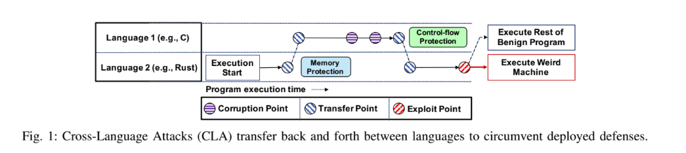
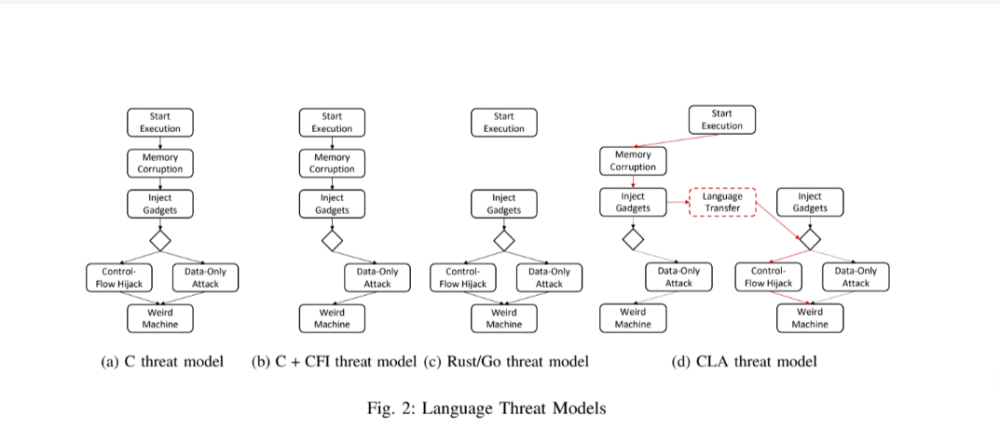

# FFI

## Why is FFI useful

FFI (Foreign function interface) is a gluing layer that allow to connect software written in different language. The use of combining software written in different languages seems relatively obvious: different languages have different strengths due to their design choices. 

In Improving Quality of Software with Foreign Function Interfaces using Static Analysis, Li. cover the reason for FFI prevalence in modern software.

Firstly, as software development requires faster processes, higher quality and faster time to market, the use of FFI seem like a good solution. FFI allows to leverage existing libraries, extensively proved, or which offer standard libraries and functionality. In the case of SPARK and Ada, using FFI allows access to software that has been proved mathematically correct and is ISO certified.

Zhuohua et al. call the method "prevalent and necessary" to avoid to duplicate work and benefit from a rich ecosystem, while using the appropriate language for "performance critical scenarios".

### Software written with FFI

Well used software composed with FFI layers can be listed easily (Li. Zhuohua. Mergendhal): 
- the Java Native Interface (JNI) glues together the Java development Kit (JDK) and its core systems libraries written in C and C++.
- the Android mobile OS includes a Java VM and a C/C++ kernel
- Firefox - studied extensively by Mergendhal et al.- is also a well known example
- the Linux kernel is also currently integrating Rust as a core language at time of writing 
- Tor 
- Microsoft Windows operating system 
- Google Fuchsia
- Docker, Kubernetes, CockroachDB, and BoltDB developed in part in Go.

Zhuohua et al. remind that in practice, Rust code is combine with C/C++ through FFI.
### Software quality goals with FFI

Li. distinguishes four software quality issues caused by FFI: security, reliability, safety and performance.

Security implies that the system "the system cannot be exploited in its FFI layer for security attacks". Reliability implies that [FFI should not]"cause the system to behave unexpectedly". Safety implies that multithreaded execution is safe. This property has been studied extensively but only for uni-language system, and is therefore not relevant for FFI. Commonly, safety issues involve"data integrity, thread synchronization, race condition, and deadlock". While the present thesis will not investigate multithreading, it is important to stress that it is a core issue in what makes FFI less safe. Performance issues are mostly related to memory management, that Li. links to "known problems such as memory leaks and dangling pointers".

## Why is FFI dangerous

Calling external code is inherently dangerous in Rust (Mergendahl, Zhuohua).

### New paradigm / conceptual approach for programmers

Li et al., stress why using FFI is an error prone process for the programmer. From the programmer, it is not only expected to reason in their own language, but accross different languages. Some differences are straightforward, such as "program semantics, language syntax, and type systems" while some are more subtle, such as "exception handling and memory management". All of the sudden, the programmer needs to understand "intricacies and complex interractions" of programming languages, as well as the context that allows the apparition of certain bugs.

In a safe language such as Rust, programmers may misuse the unsafe abilities that are provided to them (Zhozhua et al.), while "any incorrect use of FFI may corrupt Rust’s ownership system". To quantify, Zhuohua et al. found that 34 memory bugs in 987 Rust packages.

In other words, FFI "present unique challenges in both identification of the bug patterns and the design of suitable solutions to find these types of bugs" (Li.). For example, Java programmers consider "native methods as black boxes", even "avoiding the reasoning about interleaving between Java code and native code". This challenge is made harder by the lack of experience in FFI and the lack of empirical or experimental research. From the programmer or researcher side, it requires keen knowledge and comfort with both the foreign and host languages, in particular within "type
systems, exception handlings, memory management, and thread models", as well as "in-depth understanding of the interactions of
the two programming languages through the use of an FFI and the impact from the FFI
itself during the interactions". Zhuohua et al. call "the incorrect use of FFI (...) one of the most significant causes of real-world memory-safety bugs". Even safe Rust can be affected as the author found that 72% of the packages (out of 77000) were affected by dependencies that contain unsafe FFI calls.

### Hard from the compiler perspective

Mergendahl et al. also illustrate how "FFI is inherently unsafe in
Rust". Even if Rust has "additional rules" such as "dynamically-sized
types cannot be used for FFI", it still "allows the exchange of arbitrary data, including
pointers, across the language boundary". Indeed, communicating with C requires the "unsafe" keyword, which is a keyword indicating to the compiler that the programmer is taking responsibility from the compiler to ensure that this part of the code is correct.

Additionally, Mergendahl et al. lift another aspect, namely the difference between intended/unintended interractions. Their work focus on intended interractions, but they remind that unintended interractions are also possible within "multi-language application (which) share an address space".
### Bugs

#### How to find bugs

##### Static and dynamic analysis
Related work are unanimous with regards to how software bugs in FFI can be found. Static and dynamic analysis (Li). In addition, Li recommends to combine static and dynamic analysis (hybrid), such as taint targets and taint sinks to find taint paths - taint analysis relies on a pointer graph that analysis how a problematic pointer can contaminate the control flow.

In dynamic analysis, bugs are found by writing tests and will be revealed during runtime. Li warns that triggering FFI tests is difficult, due to their particular position as inter-layer between two software systems, and requires extensive manual tests. 

Static analysis bugs are discovered quicker, while scanning the code and mapping control flow. The downside of static analysis, as stressed by Li and Zhuohua, is false positive that need proper filtering. On the positive side, since static analysis does not require to run the software, it has no runtime overhead. It can identify quality issues as it checks carefully every control flow path. Finally, Li approves greatly of static analysis as bug finding tool as it requires "in-depth knowledge of static analysis, rigorous studies and research in the area of programming languages and software engineering, and proposals of novel improve
ments and applications of static analysis to address the unique and challenging issues in
software composed of FFIs", which the author sees as an positive points which create "great intellectual curiosity, interest and creativity". 

Work to improve FFI safety prior to 2014 also focuses on improving static analysis and dynamic checks. 
Even worse, the tools designed for finding bugs in FII can be "off-limits in practice for the most part for programmers who develop software using FFIs". The reasons listed by Li are that the tools are difficult and impractical to use and the bugs are rarely of practical importance. 
 

#### FFI introduces an new kind of bugs

Bugs introduced by FFI are not straightforward (Li.). They are subtle and the lack of previous experience and tools introduces additional complexity. Furthermore, in a constatation from the same author dated 2014, there was very little research "in the systematic identification of bugs caused by FFIs, whether empirical or experimental".

At the time of writing, Li insists that the search for bugs patters particular to FFI has just begun. The reports available to the author focus on a small set of problems and "touch only a few software quality issues" - while some bugs are "unique to theses systems". This is also a point confirmed by Merghendal et al., as well as Zhuohua.

##### Bugs found in the Java Native Interface (JNI)

Li. investigates bugs found in the JNI and finds them of two types.
Li. refers to studies which found hundred of interface bugs in JNI programs. Said studies used methods ranging from "type systems, experimental studies, and empirical studies". According to Li, error were cause by the fact that FFI provide close to no support for safety checking, but also because interface code requires resolving differences between language paradigms - aka "memory models and features".

Work on Rust FFI is closely related to research done on JNI (Merendahl et al). 
Without entering into too much details not too closely related to this thesis, one pattern causing vulnerabilities is the mishandled Java exceptions. At time of writing (2014), the pattern was unique (Li.). Li analyses two types of bugs. Bugs when the implementation can throw some exceptions, but the native method does not declare those. Or bugs when the implementation throws checked exception that is not a subclass of the declared exceptions by the native method. To quantify their results, Li found 147 true bugs (129 of them are because of "implicit throws" or unchecked exceptions), in popular packages such as posix, java-gnome, or several java.net, java.security or java.util packages. 

Li. adds that "the Java compiler does not perform compile-time exception checking on native methods, in contrast to how exception checking is performed on Java methods". This is similar to how the SPARK compiler GNAT works: it will not use it's prover on methods imported from Rust. Additionally, the "JVM does not provide runtime exception handling for JNI exceptions" this means that on the native side, a pending exception  will not disrupt the code execution immediately.

Li also notes that "the error pattern of mishandling exceptions is not unique to the JNI. Any programming language with managed environments that allows native components to throw exceptions faces the same issue". Rust is known for it's rich error handling management (distinguishign recoverable vs unrecoverable errors, error propagation) and Li experiments need to be verified by us as well. In addition, he notes that C is not providing exception handling, and uses a code to propagate errors to callers. He describes this process as "tedious" and leading to many programming mistakes, especially in embedded software.

##### Bugs found in the Python/C interface

Python extension modules in C/C++ can be written with the Python/C interface. But this native code is outside Python's garbage collector which does its memory management. The responsibility to count references relies on the programmer.

Python allocates objects on its heap. When no longer in use, Python's memory manager launches the garbage collector. Python is using a reference counting algorithm (Li) and every Python object has a reference-count field. Adjusting the reference count is done during program execution. On the other hand, native modules coming from C/C++ are outside the control of the garbage collector. Reference counting is very complex due to the need to control every path, as well as *borrowed or stolen references* (when the native code is saving itself some work by not incrementing reference count).
This becomes the native code responsibility and is very error prone. This problem was also stressed by Zhuohua et al. in interractions between Rust and C++.

Some of those bugs were found in Python libraries in the Fedora LINUX (Li.)

To quantify Li's results, their program found over 150 errors in 13 benchmark programs (pyOpenSSL, pyaudio, pycrypto...), with
low false positive (22%).

## Attack and example

When going further from unsafety to exploitation, in their paper Cross Language Attacks, Mergendahl et al., emphasize how "the incompatible set of
assumptions made in various languages enables attacks that are not possible in each language alone". The authors mean that "gradual deployment of safe programming languages" in a code base of unsafe language, which was assumed to improve the code base safety was in fact proven to be an issue. By doing so, the authors add a new vector of attack to the current knowledge on security, the Cross language attack vector. They demonstrate that the "philosophy of incrementally hardening
memory unsafe code with memory safe code can have serious flaws—beyond C/C++ hardening bypasses—if not handled properly".

Although Rust and other "modern, safe programming languages" such as Go, Swift, are "touted as he best chance for safe software", the authors show with several examples how an exploitation is possible because of the combination of safe and unsafe languages. Furthermore, since exploitation in unsafe languages without protection are "trivial", the authors focus on the case where FFI is bridging unsafe code with *some* protection, and safe code. 

To illustrate cross language based exploitation, the authors build a model that combine several steps. Each step represent a security check to prevent a runtime exploit. 

The model simulates different stages of an exploit. They show how those checks -especially at the boundary between two languages- create "an incompatible set of assumptions" that an attacker can navigate effectively, to perform an exploit that does *not violate* safety assumptions on both side of the FFI. 
The authors insist that their model, while focusing on Rust and C++ for simplicity, can generalize to other safe language. It is natural to wonder how it can generalize between two safe languages such as SPARK and Rust. In their conclusions, Merendahl et all note that they believe it is the case for Rust and Go. Those two safe languages have different strategies around memory safety" - lifetime and garbage collection. If a system combining both disagree, double frees and use after frees are still possible, which open the door to "other subtle vulnerabilities" according to the authors.

In the above figure, the CLA starts in a safe language (Rust), where memory safety is garanteed. The CLA transfers to the unsafe language to proceed to the memory corruption. The guarantees in the unsafe language ensure that control-flow hijacking is made impossible. The CLA transer back to the safe language to execute the *weird machine*. In summary, the unsafe language assumes [...] hardening (control flow integrity) which prevents the control hijacking while the safe language assumes the program is free of corruption.

Mergendahl et al. successfully illustrate that any FFI established without "extreme care" can lead to artfully crafted exploits, where the classic control-flow hijacking was not possible before. They show that the thread model for a multi-language application is the "union of the threat models of the constituent languages".

## How are attacks set up

Mergendahl et al. analyse that attacks have four essential phases: "one: memory corruption,
two: gadget injection, three: control-flow assumption, and four: weird
machine execution". Even if defence mechanism have focused on steps one and three, the defender can interrupt any of those steps to prevent the attack.
Memory safety offered by, amongst others, Rust, removes the node memory corruption (node in 2c). Research has shown that it cannot be retroactively baked into the language, and cannot be implemented retroactively into C (Mergendahl).

Figure 2d illustrates a CLA attack, not possible using single-language applications. On the C side, the hardened code prevents "control-flow hijacking by validating code pointers before they are used". The Rust side provides protection against the same attacks 
by enforcing memory safety. However, this does not make the C side memory safe, and Rust does not validate the code pointers - assuming memory safety. 
The attacker can take advantage of the C language weaknesses to combine memory corruption and non-validated pointers in Rust. 
Merendahl et al. insist that the problem is much deeper than what meet the eye. They could demonstrate a control-flow hijacking, but the "weakest link principle holds for any element of an application’s threat model that varies across languages". If one part of the code introduces code signing and validation (on the Rust side), but another part of the code did not (C libraries), then the cross language application remains completely vulnerable to supply chains attacks.

Finally, the authors introduce the most "insidious case of multi-language applications". The component languages can have eliminated a threat but using different assumptions. The result is that "the combination of two “safe” languages itself being unsafe", a theory that is of the utmost interest in the frame of this thesis -as both Rust and SPARK are safe languages.

The authors also underline that the cost of writing such attacks is relatively simple: contrarily to COOP (Conterfeit Object Oriented programming) and DOP (Data oriented programming) which require "new primitives", CLA oppens a new avenue of attack reusing old vulnerabilities "brought back to life", in addition to CLA specific vulnerabilities. The authors call those attacks "revenant vulnerabilities". 

### Overview of revenant vulnerabilities

Rust memory safety reposes on two component: the type system and dynamic checks. For objects which size is not known at runtime, bound information are stored in memory. Unfortunately, as arbitrary writes can affect any memory shared in the multi-language application, such protections can be rentered useless.

Rust temporal safety is relying on the borrow checker. However, Double Frees or Use After Free can be done accross the boundaries of FFI.

Shadow stacks and CFI are widely use in C/C++ applications. However, as the Rust side is assuming memory safety, it will not use CFI and the protection of the application is only partial. Rust can be used to bypass CFI verification.

Another way to bypass Rust temporal safety is exploiting its assumption on memory safety. Rather than rely on the programmer to manage memory, Rust type system attack a lifetime to each object. "By default, Rust uses the libc
malloc() implementation, meaning that Rust-
C/C++ applications in practice share a heap managed by the same allocator. Thus, C/C++ may deallocate memory without Rust’s knowledge".

### Overview of specific to CLA vulnerabilities

Still according to Merendahl et al, some problems arise only in multi-language context: "Rust’s spatial memory safety can rely on bounds stored in memory which is only safe if the entire application is memory safe" and secondly, "Rust’s automatic memory management relies on it being the only entity controlling the allocation status of memory - and they demonstrated previously that it was not the case, as Rust use malloc() and share a heap with other components of multi-language applications. Two additional ways - passing bad values and complex serialization - can cause further vulnerabilities.

#### Corruption of dynamic bounds

As seen previously, the attacker can corrupt the recorded size of an object, enabling buffer overflow and arbitrary writes. For example, in its vectors, Rust has a field to record size and capacity. By writing to those fields, the attacker can change values arbitarily and authorize OOB access, not triggering Rust panics.
As a consequence, Rust spatial memory safety is at the same level as C++.

#### Double frees

Double-free is a very common temporal error. Merendahl et al. demonstrate that when an unsafe language frees a Rust object, Rust will still try to free it at the end of its life time. The authors remind the extend of exploits related to double-frees. In addition, the Rust program could write over the memory it has just freed, "operating at the same level of temporal memory safety" then C.

In addition, "Mixing different memory management mechanisms is undefined behavior, because Rust and C may use different memory allocators" as stressed by Zhuohua et al.

#### Intended interractions over FFI

Merendahl et a. observ that while an attack is simplified when safe and unsafe languages share a pointer, they can be more complex when they share data. Especially when the safe language is handed a pointer by the unsafe language to populate a buffer: the safe language must trust the shared pointer as it has no means to verify that the contents are valid. 

Zhuohua et al observ taht heap allocated object can be passed by borrowing the object as a reference or moving the ownership on the other side of the FFI. In the first case, the ownership system will need to free the memory -as per the language design!-. In case the ownership is moved to the unsafe language, Rust allows to forget about the object with specific functions (std::mem::forget). In that case, the responsibility returns to the developer, opening an avenue of possible human error that Rust was supposed to prevent in the first place.

Other interractions that are a source of error is the conversion of Strings.
Strings in Rust and C have completely different representations. This illustrates the need of serialisation, a well known source of errors (Merendahl et al).

#### Concurrency 

Concurrency is another challenge in real world application as all threads have access to the entire memory space (Merendahl et al).

#### Exception safety

Zhuohua et al. remind that Rust provide a very advance error management, distinguished between recoverable and recoverable errors. 
However, when heap memory is passed through FFI, unsound states are created via unsafe code (temporarily uninitialized data): in case of error, the execution stops and the stack is unwound, not leaving room to clean up procedures (calling stack object destructors on the Rust side). This is a possible security issue.
