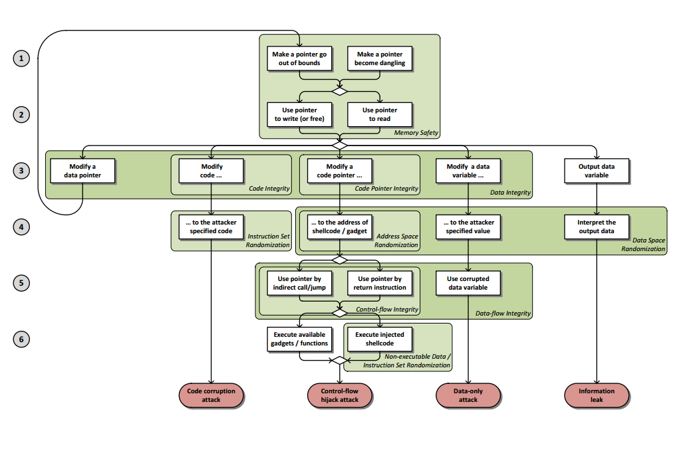
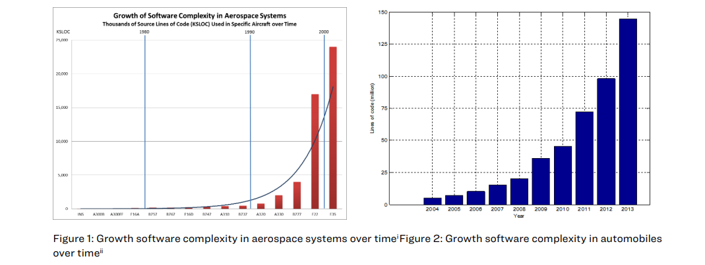

# State of software safety

The literature around the state of software security is rather unanimous on the threats (caused by memory-safety issues) and the underlying reasons for those threats (unsafe languages). 

## The monopoly of C/C++

C/C++ are by nature unsafe languages. They are designed for direct interraction with memory and can modify it without any restriction. Mergendahl et al. state that the underlying root to all evil, namely memory corruption, come from the error prone process  of delegating all security checks to the programmer. As a consequence, developper errors introduce spatial and temporal errors.

Both C/C++ are unavoidable as systems programming. Because of their performance, they are unvavoidable as building bricks of software. C/C++ are also prevalent in embedded systems. Renouncing C/C++ is equivalent to renouncing to performance and loosing the fine-grained control necessary to work with low level systems.

This thesis is focusing on multi-language applications, more precisely, Rust and SPARK. But this does not mean that safe languages are not affected by the security state of applications written in C/C++. Ada (and its subset SPARK) were designed to interract with existing low-level applications written in C/C++, and are dependent on dependencies written in unsafe languages. 

And lastly, as we will see in the next part (FFI), multi-language applications have additional weaknesses that need to be taken into account.

## The "Eternel War"

C/C++ are especially susceptible to memory errors, because of the freedom they give to the programmer. In their paper "SoK: Eternal War in Memory", Szekeres et al. call the memory corruption bugs in low-level languages "one of the oldest problems" in security. Memory errors have been exploited for 30 years, while real world exploit prove that protections can always be defeated. 

The authors establish that, not only there does not exist a system that is completely secure, but that protection mechanisms never achieve wide adoption. Indeed, those mechanisms present a significant overhead. Those overhead can be in terms of performance (e.g, garbage collector are costly in systems relying on speed) or simply the cost of replacing billions of existing C/C++ lines. 

They inform that the either, performance overhead is such that it is not worth the benefits of the protection, or the approach is not robust enough. Another issue may be problems of incompatibility with legacy code and dependencies.

In the C++ standard, writing OOB in an array, dereferencing null pointers or reading uninitialized variables result in undefined behaviour. Buffer overflows, double-frees and use after free are very common errors (Szekeres). Those errors can be leveraged into full-fledged attacks, as "every exploit starts by triggering a memory error" (ibid). The process is two-fold. The first is to make a pointer invalid, and the second is dereferencing. Attackers can exploit either dangling pointers (temporal error) or an out of bound pointer (spatial error). The techniques can be combined and chained for successful exploitation.

Figure: Attack model demonstrating four exploit types and policies mitigating the attacks in different stages by Szekeres et al.

To mitigate those problems, various tools have made their apparition, as well as exploit mitigation techniques. The lattest can be devided into enforcement (control flow integrity) or randomization based (memory randomization) (Merendahl et al.). 

Unfortunately those tools are providing very limited protection, while facing a professionalisation and increase of complexity from the attacking side. According to the same authors, "sanitizers suffer from coverage limitations", with many missed bugs as a consequence, while "enforcement-based exploit mitigation techniques" can still allow attacks that do not violate their policies because of their relaxed-enough policies, and randomization techniques remain succeptible to information leakage.

### Scope of the problem

Attacks on memory in the literature and professional blogs lists long lists of exploits of software written in C/C++. The MITRE lists memory-safety exploitatio high on the CWE Common Weakness Enumeration[^1], in parallel with improper input validation  - with examples such as	Out-of-bounds Write (1st), Out-of-bounds Read (5th) and use after free (7th).

In a very much cited blog article, Alex Gaynor [^2] reports that in a million LOC code base written in an unsafe language, 65% of security vulnerabilities can be expected from memory unsafety.
Gaynor cites code bases such as Android (use-after-free, double-free, and heap buffer overflows representing over 65% of bugs in Chrome and Android), iOS and macOS (between 66.3% and 71.5% memory safety bugs), Microsoft (70%  memory safety issues) and Ubuntu Linux kernel (65% of Ubuntu security updates to the are related memory unsafety).

Gaynor provides other examples but the figure 65 to 70% is consistent and in academic litterature(Mergendahl et al, Scherer) and security blogs.

Some protections are deployed in common systems, such as "stack cookies, exception handler validation, Data Execution Prevention and ASLR (Address Space Layout Randomization)" but several attack vectors are still effective agains those: "Return-Oriented Programming (ROP), information leaks, and the prevalent use of user scripting and just-in-time compilation" (Szekeres). 
## Challenges to design secure software

Szekeres et al. mention that the best solution *would be* to avoid writing software in C/C++ altogether and regret that such thing is impractical and impossible, when Scherer and other sources recommend safe languages for new projects. But for reasons mentioned above, this is not going to happen.

But writing safe software is hard, or downright impossible. Moy and Aiello advocate for formal methods, especially in the safety-critical industry, since testing does not cover potential failures.

The safety-critical industry is producing products such as (not exhaustively): "aircraft (...) automobiles, medical devices, home appliances, (... and...) our homes themselves". As those products integrate start to rely on software for functionality, and move from hardware-only to the cyber-physical space, they become vulnerable. Futhermore, they warn that software complexity is increasing, aggravating challenges to software security.

Moy and Aiello report security incidents which brought down ATT (with a cost of $60 and long lasting damage to its reputation), the US FDA arning against almost 500 thousand cardiac devices that put the patients in pain or at risk of death, and the infamous WannaCry ransomware attack that ecrypted 200 thousand computers in 150 countries and costed up to $8 billion dollars.

Scherer reports successful attacks of "train schedule systems, entire energy grids, hospital networks, vehicular control software and even critical aircraft systems". Scherer means that security needs to be built in software development, instead of an add-on or an afterthought. Scherer also notes the "continuously increasing rate of bugs with increasing project size amongst other factors in long lived projects" and a slow turnaround time" for software improvement (1 to 10 years), which cause problems to pile up.

### Exploitation: Not if, but when.

In addition to complexity, Moy and Chapman remind that we evoluate in a malicious environment. Writing secure software is equivalent to “Programming Satan’s computer” (as coined by Anderson and Needham): *"Satan’s computer doesn’t fail randomly either — it fails intelligently, in the worst - possible way, at the worst - possible time, and it can fail in ways that you don’t even know about"*. 

When it comes to security, the software developer faces a series of asymetries (Moy and Chapman). An asymetry of capability, meaning that the malicious actors capabilities does not grow in a predictable and linear way. An asymetry of effort: while the programmer has to secure all possible security indoors, the malicious actor needs to find just one breach in the system. Asymetry of knowledge, which is self explanatory in the context of rapid progress of knowledge and technical support. And lastly, an asymetry of impact, as the impact and destructivity of a default is in principle unpredictable. 

Scherer notes that a defect is indeed guaranteed to be exploited when discovered as malicious actors systematically screen for deffect. As a result, "the chance for a defect to be discovered by the attacker is significantly higher than the randomized detection happening during testing".

While basic approaches like "like modeling, formal analyses different stages of testing,continuous integration and traceability of requirements are applied in modern projects" (Scherer), some are reserved to critical safety software. In addition, modeling can suffer from under-modeling and over-modeling (Scherer) become non suitable to improve the software.

## Mitigation
### Can we reach memory safety by using safe languages?

Not quite. 

While safe languages are "touted as the solution" (Merendahl), that it is said that "has a significant impact on project success and defect rates" (Scherer) and that some recommended to avoid using C/C++ (Szekeres), we remain dependent to C/C++ for many reasons (legacy, dependencies, not reinventing the wheel for duly tested libraries, cost...). And indeed, most of the real world software we utilise combine several languages.

According to Merendahl et all, to date, there is work on securing multi-language applications. This body of work is based on formal methods, securing FFI, isolation or sanitizers. 

But this work is not sufficient to ensure safety. Merendahl et al. warn that because of differing assumptions, multi-language applications are reduced to their weaker link. The previous statement is true for both safe/unsafe *and* safe/safe pairings. In those conditions, more research and recommendation on how those pairings must be made is necessary.

The authors state that the utmost "care must be taken to ensure that the application as a whole is not weaker than its constituent parts, which reminds of the design of C/C++ that leaves responsibility to avoid errors to the programmer. 

### Dependencies

Many safe languages are dependent on libraries written (but duly tested!) in unsafe languages. Those dependencies are not going anywhere.

Merendahl et al. remind that applications written in C++11 "are still backwards compatible with older C++ standards and C applications, and often feature code with older code standards" especially imported libraries. Such components fragilize safety garantees. Zhuohua found that over 54000 out of 77000 were affected by chain of dependencies that contain unsafe FFI calls.

[^1]: [MITRE 25 top weaknesses](https://cwe.mitre.org/top25/archive/2022/2022_cwe_top25.html#cwe_top_25)
[^2]: [What science can tell about C and C++ security](https://alexgaynor.net/2020/may/27/science-on-memory-unsafety-and-security/)