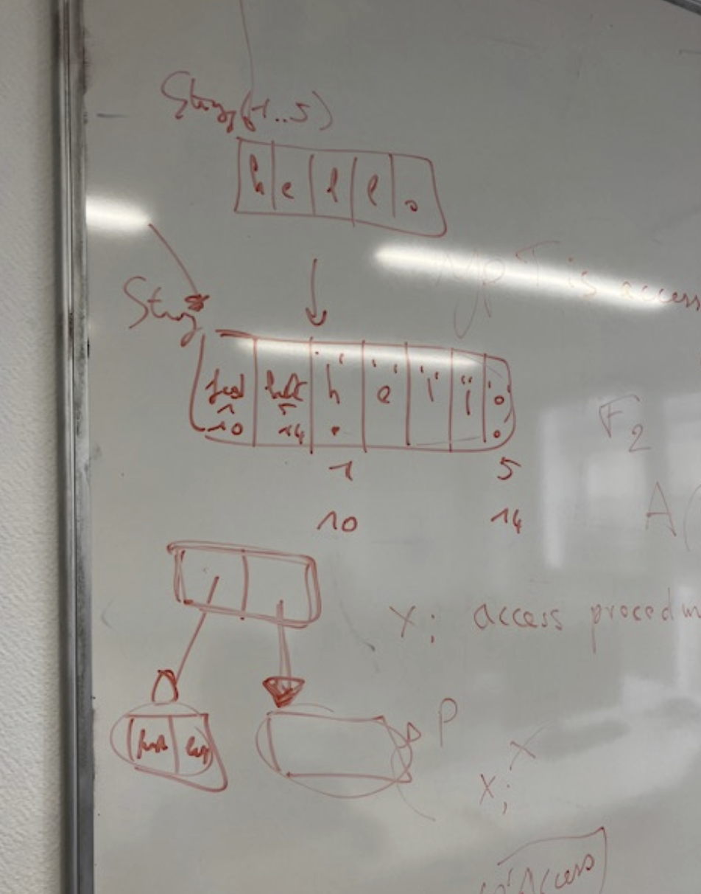

# Pointers


## Rust

Referencing rules in Rust
1. never null
2. pointing to living data 
3. &mut is never allowed to alias
The rust side will be sure that there is no alias.
1. In the p_pointer program: if not a mutable pointer, the dereferencing becomes unsafe


## Ada
Pointers carry information like in Rust
When sending pointers to C, they loose information
Pointers are never null
At human level, protected by the typesystem
Interface C.String exist to copy C type strings.
Pointers have structural equality, but nominal equality in Ada
Spark has ownership
Impossible to have a pointer that escapes in SPARK
Access can point only to the heap
Global variable defined as access all
No pointer arithmetic as in Rust and protection from deallocation (not the case in Ada)
The secondary stack


p_pointer
	Description: receiving an access from Ada and incrementing on the Rust side. SPARK (in SPARK mode) has the same ownership rules than rustc.
The aliasing was possible in Ada, but not in SPARK. So use SPARK or do not use &mut pointers. This is legal in Ada:

```Ada
with Ada.Text_IO; use Ada.Text_IO;
with Ada.Unchecked_Deallocation;
procedure Main is
   type Point is record
      X, Y : Integer := 0;
   end record;
   type PtrPoint is access Point;
   P     : Point;
   PPtr  : PtrPoint := new Point'(P);
   PPtr2 : PtrPoint := PPtr;

   procedure Free is new Ada.Unchecked_Deallocation
     (Object => Point, Name => PtrPoint);
   procedure Point_increment (ptr : PtrPoint) with
     Import, Convention => C, Global => null;
begin
   Put_Line (PPtr.all'Img);
   Point_increment (PPtr);
   Put_Line (PPtr.all'Img);
   Put_Line (PPtr2.all'Img);
   Point_increment (PPtr2);
   Put_Line (PPtr2.all'Img);

end Main;
```
But illegal in SPARK:
```terminal
 gnatprove -P p_pointer.gpr 
Phase 1 of 2: generation of Global contracts ...
Phase 2 of 2: flow analysis and proof ...

main.adb:24:19: error: dereference from "PPtr" is not readable
   24 |   Put_Line (PPtr.all'Img);
      |             ~~~~~^~~
  object was moved at line 15
   15 |   PPtr2 : PtrPoint := PPtr;
      |                       ^ here

main.adb:25:21: error: "PPtr" is not readable
   25 |   Point_increment (PPtr);
      |                    ^~~~
  object was moved at line 15
   15 |   PPtr2 : PtrPoint := PPtr;
      |                       ^ here

main.adb:26:19: error: dereference from "PPtr" is not readable
   26 |   Put_Line (PPtr.all'Img);
      |             ~~~~~^~~
  object was moved at line 15
   15 |   PPtr2 : PtrPoint := PPtr;
      |                       ^ here
gnatprove: error during flow analysis and proof
```

“ Parameter modes, arrays, and varying size types are all constructs that can replace typical pointer usages in C.”
Plus de precisions:

| First     | Last      |     |     |     |     |     |
| --------- | --------- | --- | --- | --- | --- | --- |
| 1 (or 10) | 5 (or 15) | 'h' | 'e' | 'l' | 'l' | 'o' |




En C le pointeur fait toutes ces choses. In out ⇒ c’est un pointeur, les tableaux ⇒ pointeur, en ada encodage dynamique pour first last, taille. Le compilateur fait des choix


Quand on communique avec C on perd les fat pointers, si la fonction a une convention C on passe le pointeur au premier caractère. De la meme facon quand on récup C on a le premier caractère et il nous manque les bornes.
Que faire pour interfacer Rust et Spark.


Certaines librairies standards (Interfaces.C.String) par copie. Rien de typesafe.

“Second, Ada has made pointers as safe and restricted as possible, but allows "escape hatches" when the programmer explicitly requests them and presumably will be exercising such features with appropriate care.” I will need a full comparison with Rust for that

“In most other languages, pointer types are structurally, not nominally typed, like they are in Ada, which means that two pointer types will be the same as long as they share the same target type and accessibility rules.”

Égalité structurelle int* == int* (en C)
Égalité nominale type T1 is access Integer != type T2 is access Integer
Pointer en Ada == tableau avec les limites
Read embedded Ada!!
Deallocation dynamique
Unchecked_deallocation := ada ne vérifie pas (unchecked)
SPARK := ownership

Problèmes de pointers → un pointer vers le stack qui s’échappe, impossible en STARK ou en ada car les pointers sont protégés par les types.
Le niveau d’accessibilité (1 == global) 
(à reproduire)
2 types de pointers (tas == heap) soit la pile. “Access” peut juste pointer vers le heap
Adresse d’une variable globale ou locale doit être défini comme access all/ access constant
!= types de pointeurs. Interdit de deallouer qqchose qui pointe vers le stack (n’a pas été alloué dynamiquement) - ne peut pas déallouer aspect constant.

Pointeur qui s’echappe 
Declarer variable sur le stack et déclarer addresse

“As you might know if you have used pointers in C or C++, we are still missing features that are considered fundamental to the use of pointers, such as:”
Arithmétique de pointeur n’existe pas en rust, pas intéressant
Deallocation en ada n’est pas sûr alors qu’en spark l’analyse protège de l’erreur

Can we talk about this “The guideline in Ada is that most of the time you can avoid manual allocation, and you should.” Can you detail on that 

Secondary stack return a chain of chars from a function
