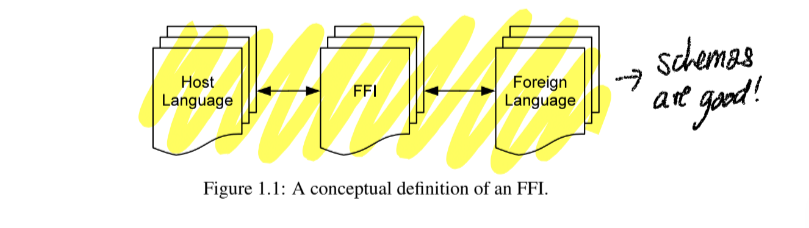

# Li - Improving Quality with FFI using static analysis

The thesis investigates several particular characteristics of FFIs and studies software
bugs caused by the misuse of FFIs. We choose two FFIs, the Java Native Interface
(JNI) and the Python/C interface, as the main subjects of this dissertation. 

**not as good as Rust but still relevant in the frame of FFI**

**the goal is to improve software quality**

**FFI is a gluing layer**

Today’s software development demands faster time-to-market as well as more reliability
and higher system performance. The use of FFIs allows programmers to achieve these
goals. Programmers can focus on introducing and developing new functionalities while
leveraging FFIs to connect together existing libraries and system software that offer the
more common and standard functionalities. For the most part, these libraries and system
software are proven over the years for their reliability and performance
**the inevitability of FFI, and in the case of SPARK, ISO**

Programming with FFIs is an error-prone process. A programmer needs to know thor-
oughly about both host programming languages and foreign programming languages,
especially the differences between the two. Some of the differences are obvious, such
as program semantics, language syntax, and type systems. But some are subtle, such
as exception handling and memory management. 

**subtle and obvious differences**

**the problems are many, exception handling and atomicity for example**

For instance, memory resources
6
allocated in a foreign language can be out of reach of the memory management of a
host language and cannot be reclaimed automatically. 
**this is exactly as said in CLA paper**

Security
A secure software system composed of an FFI means that the system cannot be ex-
ploited in its FFI layer for security attacks.

Reliability
exceptional situations in the FFI should not cause the system to behave unexpect-
edly.

Safety
These safety issues commonly involve data integrity, thread synchronization,
race condition, and deadlock. I
**threads are outside the scope of this thesis**

Performance
 After all,
many programmers choose to use FFIs for the purpose of achieving higher performance;
 We
are interested in finding the commonly known problems like memory leak and dangling
pointers in software composed of FFIs

FFIs present unique challenges in both identification of the bug patterns and the design
of suitable solutions to find these types of bugs

Bug definitions are not always easy because of their subtlety, little previous expe-
rience, and complexities involved.

There had been little research done in the systematic identification of bugs
caused by FFIs, whether empirical or experimental.

Typically, there are two means for finding software bugs:
dynamic analysis and static analysis
**but how applicable is it for FFI**
identifications of bugs or bug patterns that exist in software
composed of FFIs have just begun.

A few recent studies reported hundreds of interface bugs in JNI programs ([26, 40,
86]) by using type systems, experimental studies, and empirical studies, respectively.
Errors occur often in interface code because FFIs generally provide little or no support
for safety checking, and also because writing interface code requires resolving differ-
ences (
e.g.
, memory models and language features) between two languages. Past work
on improving FFIs’ safety can be roughly classified into several categories: (1) Static
analysis has been used to identify specific classes of errors in FFI code [25, 26, 87, 40];
(2) In another approach, dynamic checks are inserted at the language boundary and/or
in the native code for catching interface errors (see [45]) 

 Third, bug finding
tools designed in research settings, especially in the area of FFIs, are still off-limits in
practice for the most part for programmers who develop software using FFIs

First, it is among the first to clearly identify a set of software bugs in FFIs. Because
of the challenges in understanding the intricacies of programming languages, their com-
plex interactions through the use of FFIs, and the context under which bugs can arise,
the bugs that we are interested in are subtle and not easily discernable but all have
critical implications

A Java compiler does not perform compile-time exception checking on native
methods, in contrast to how exception checking is performed on Java methods
**same for SPARK, it will not prove IMPORT**

he JVM does not provide runtime exception handling for JNI exceptions. An
exception pending on the native side does not immediately disrupt the native-
code execution, 

ronment pointer contains entries for JNI function pointers, through which C code can
**try to read outside assigned memory**

The error pattern of mishandling exceptions is not unique to the JNI. Any program-
ming language with managed environments that allows native components to throw ex-
ceptions faces the same issue

Since the C language does not provide language support
for exceptions, C functions often use integer return codes to report errors to callers.
27
Callers must use these return values to check for error conditions and perform appropri-
ate actions such as handling errors or propagating errors to their callers.
**what about returning results**

2.6.1 Determining unsafe operations
Our strategy for determining unsafe operations is an algorithm of whitelisting plus static
taint analysis.
Whitelisting
The whitelist is comprised of those operations that are absolutely safe to use when an
exception is pending. 

**the goal of the thesis is whitelisting**

Intuitively, a tainted pointer

**can we have tainted pointers**

Having constructed the pointer graph, it is easy to compute what pointer values in the
example program may be tainted.

**maybe free a pointer from Rust**

ll experiments were carried out on a Linux Ubuntu 9.10 box with Intel
Core2 Duo CPU at 3.16GHz and with 512MB memor
**they write their environment**
**important for reproducibility**

Conceptually, there are two categories of bugs. The first category contains those bugs
when a native method does not declare any exceptions but its implementation can ac-
57
tually throw some exceptions. The second category contains those bugs when a native
method declares some exceptions but the implementation can actually throw a checked
exception that is not a subclass of any of the declared exceptions. 

**this is Java and JNI but may be relevant**

Of the 147 true bugs, 129 of them are because of implicit throws,
while the rest are because of explicit throws. That is, the majority of the errors are
because programmers forgot to check for exceptions after calling JNI functions. This
result is consistent with our expectation

xceptions are commonly used in FFIs as ways for the foreign language to report error
conditions to the host language. FFI programmers often make mistakes related to excep-
tions since FFIs do not provide support for exception checking and exception handling.

ava programmers often view native methods as black boxes,
**as it should be** 
**but other sources consider that we need to reason accross different languages**

Native modules incorporated in a Python program, on the other hand, are outside the
control of Python’s garbage collector. When those native modules manipulate Python
objects through the Python/C interface, reference counts are not adjusted automatically
by the Python runtime and it is the native code’s responsibility to adjust reference counts
in a correct way (through
Py
INCREF
and
Py
DECREF
, discussed later).

Certain
functions borrow references and certain functions steal references
**what is stealing references**

 1) software quality,
2) software and system engineering, 3) static analysis, and 4) FFIs’ safety, reliability, and
security. In this section, we discuss systems that are closely related to this dissertation.
**related work**

arly work on FFIs were mostly concerned with how to design an
FFI and how to provide efficient implementation

FFI-based code is often a rich
source of software errors: a few recent studies reported hundreds of interface bugs in
JNI programs ([26, 40, 49]). Errors occur often in interface code because FFIs generally
provide little or no support for safety checking, and also because writing interface code
requires resolving differences (
e.g.
, memory models and language features) between two
languages. 

 Taint analysis, either static (
e.g.
, [54, 38, 91, 5, 92]) or dynamic (
e.g.
, [67,
93, 68]), has been successfully applied to preventing a range of attacks (
e.g.
, format
string attacks [77])

rrors occur often in FFI code [26, 87, 40, 49] because writing interface
code requires resolving language differences such as memory management between
two languages. Past work on improving FFIs’ safety can be put into several categories.
First, some systems use dynamic checking to catch errors (
e.g.
, [45]), to enforce atom-
icity [48], or to isolate errors in native code so that they do not affect the host language’s
safety and security [80, 85]. Second, some researchers have designed new interface
languages to help programmers write safer interface code (
e.g.
,[31]). Finally, static
analysis has been used to identify specific classes of errors in FFI code, including type
errors [25, 26] and exception-handling errors [49, 50]. 

Exploring beyond using static analysis alone is another promising direction. Besides
static analysis, dynamic analysis and even hybrid analysis that combines both static
analysis and dynamic analysis can be considered for finding bugs in software composed
of FFIs. For example, in taint analysis, there are several studies that use static analysis
to target the most possible taint targets and taint sinks, while using dynamic analysis to
find the possible taint path, which can be quite efficien