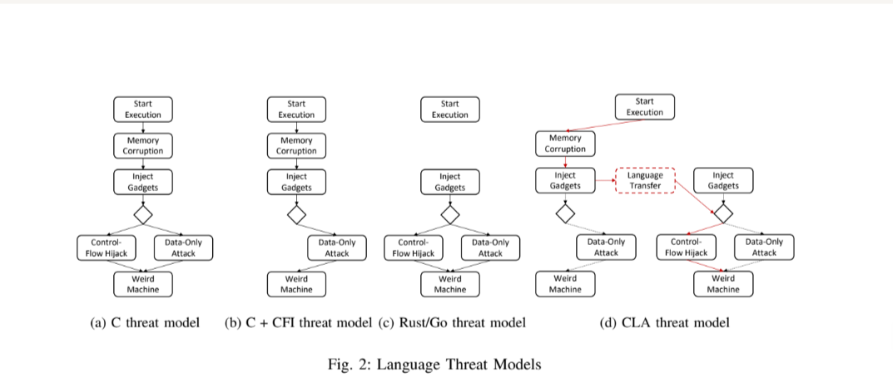

# Mergendahl - Cross-Language Attacks

**keywords: incompatible assumptions**

In essence, we illustrate that the incompatible set of
assumptions made in various languages enables attacks that are
not possible in each language alone.
Our findings show that gradual
deployment of safe programming languages, if not done with
extreme care, can indeed be detrimental to security

**already in the abstract they announce the flavor**

As another example, Go has
a garbage collector to provide temporal memory safety [72].
While these languages provide keywords to ignore the safety
checks of the language when necessary (
e.g.,
the
unsafe
keyword in Rust is used to interact with low-level hardware
devices), within the confines of the safe code, the applications
written in these languages are considered generally safe. In
fact, these languages have been touted as the ‘best chance’
to develop safe systems [57] and their gradual deployment
is underway in multiple popular applications and code bases.

**safe languages are hyped**

we specifically focus on the case where some protection is
applied to the unsafe side (
e.g.,
CFI for C/C++) and the
safe side does not contain
unsafe
code. 

**and this is what we are targeting in the ideal, but calling SPARK is inherently unsafe, and we do it in an unsafe block. Need to check that**

We further illustrate that
these checks create an incompatible set of assumptions on each
side. Leveraging these incompatibilities in the safety checks
performed, we show that an attacker can maneuver between the
languages in a way that allows the exploit to succeed without
violating the safety checks on either side.

**this is a risk that is treated in this paper but not really in the thesis, we will not go and look into the actual attacks**

control-flow hijacking
where none is possible in individual languages alone.

### Background on the history of memory attacks

Memory corruption attacks have posed a major threat to
computer systems for decades [84], [114]. The complexity of
these attacks have increased over the years from simple stack-
based code injection attacks [84] to various forms of code
reuse attacks [101]. The underlying root cause of memory
corruption attacks is the unsafety of programming languages
like C/C++ that delegate security checks to the developer. De-
veloper mistakes thus result in the introduction of spatial (
e.g.,
buffer overflows) and temporal (
e.g.,
use-after-free) memory
corruption bugs that can be exploited by an attacker.
In response, various offline analysis tools (
i.e.,
sanitiz-
ers) [108] and runtime exploit mitigation techniques [26],
[66], [114] have been developed to find these bugs prior to
1
https://github.com/mit-ll/Cross-Language-Attacks
deployment and prevent their exploitation while deployed,
respectively. Runtime exploit mitigation techniques can be fur-
ther categorized into enforcement-based techniques [114] and
randomization-based ones [66], [80]. Control-flow integrity
(CFI) [25] is an example of the former, while memory random-
ization [86] is an example of the latter. However, these tech-
niques have been shown to only provide partial protection at
best. Sanitizers suffer from coverage limitations, often result-
ing in many missed bugs [108]. In addition, enforcement-based
exploit mitigation techniques are shown to provide relaxed-
enough policies that allow an attacker to mount a successful
attack without violating their policies [27], [41], [52], while
randomization-based techniques are shown to be vulnerable to
various forms of information-leakage attacks [40], [99], [110].
Perhaps the ultimate indicator of the limitations of securing
unsafe languages is the prevalence of memory corruption bugs
in modern systems, despite attempts to catch or mitigate them
during development and while deployed. According to multiple
studies, memory corruption bugs account for a large fraction
of vulnerabilities (up to 70%) today [73].
The limitations of protections applied to unsafe program-
ming languages have motivated a new generation of program-
ming languages that provide safety properties natively [81],
[82]. Rust and Go are two such languages. We briefly describe
how Rust and Go provide memory safety below

**this is pretty excellent and need to be reused**

### About FFI

FFI is inherently unsafe in
Rust, and allows the exchange of arbitrary data, including
pointers, across the language boundary.

We refer to transfers of control flow between languages in
a multi-language application through FFI as
intended
interac-
tions.
Unintended
interactions are also possible as applications
within the multi-language application share an address space.
While intended interactions have been the subject of some
prior work [77], and similarly, some previous work encourages
sandboxing safe language memory from unsafe languages [91],
we believe the relationship between intended/unintended in-
teractions and the preservation of language threat models in
multi-language application have to date been under investi-
gated by the community.
**mention that they mean intended interractions only**

### Threat model

We build on existing work [114] presenting high-level
threat models for software security, and extend these models
to hardened and multi-language applications. In particular, we
show that the threat model for a multi-language application is
the union of the threat models of the constituent languages. In
graphical terms, creating a multi-language application threat
model involves adding edges from each node in the threat
model to a new “language transfer” node. This can lead
to multi-language applications being weaker than their con-
stituent parts due to CLA, a concerning negative synergy.

Language Transfer
nodes. Language transfers occur
when an application deliberately interacts with a component
in another language (
e.g.,
through FFI).
**more about FFI threats!**

The fundamental problem here is a mismatch of assump-
tions in the individual language constituents of a multi-
language application. Multi-language applications have the
security of their weakest constituent language. While we have
illustrated the issue here with a classic control-flow hijacking
attack, the problem is much deeper than that. The weakest
link principle holds for any element of an application’s threat
model that varies across languages. For instance, if Rust were
to introduce code signing and validation to mitigate supply-
chain attacks and C libraries did not, then a multi-language
application composed of those two languages would remain
completely vulnerable to supply chain attacks

**pick up graphs and code examples**

In fact, our goal is
to demonstrate that the philosophy of incrementally hardening
memory unsafe code with memory safe code can have serious
flaws—beyond C/C++ hardening bypasses—if not handled
properly

Rust’s spatial
memory safety can rely on bounds stored in memory which
is only safe if the
entire
application is memory safe. Second,
Rust’s automatic memory management relies on it being the
only entity controlling the allocation status of memory. 

Beyond reviving the threat of memory safety vulnerabilities
in “safe” languages, and bypassing existing partial memory
safety defenses in unsafe languages, multi-language applica-
tions are vulnerable to variants of CLA that only arise in
the context of multi-language applications. In particular, we
highlight four such new vulnerabilities. First, Rust’s spatial
memory safety can rely on bounds stored in memory which
is only safe if the
entire
application is memory safe. Second,
Rust’s automatic memory management relies on it being the
only entity controlling the allocation status of memory. How-
ever, Rust commonly uses the libc
malloc()
implementation
under the hood, giving rise to vulnerabilities in multi-language
applications. Third, we highlight two additional ways intended
interactions via FFI over the language barrier can go wrong:
passing bad values and more complex serialization/deserializa-
tion errors. Finally, we describe how multi-threaded programs
heighten vulnerabilities. 

A. Corrupting Rust Dynamic Bounds
By corrupting the recorded size of
the object, an attacker can enable a buffer-overflow of arbitrary
length in Rust. 

B. Double Frees
if C/C++ frees a Rust object, Rust will
still try to free that object at the end of its lifetime, 

C. Intended Interactions over FFI
In either case, Rust has no
way of verifying that the shared pointer—or its contents—is
valid, and must trust C/C++.
 For instance, C/C++ strings and
Rust strings have different representations, forcing conversion
through null terminated C/C++ strings for compatibility over
FFI. This illustrates the need for
serialization
over the FFI
interface. Serialization is a well known source of errors [87],
but it has primarily been considered in inter-application scenar-
ios (
e.g.,
I/O to networks, Files, or IPC), not intra-application
scenarios where it arises as a type of CLA

D. Concurrency and CLA
. All threads have access to the entire memory space,
meaning that a C/C++ function executing on one thread that
contains an arbitrary write can attack a Rust function oper-
ating on a separate thread. 

**then there are some words about Mozilla and the type of functions that exist, how much Rust, how much cpp, pointers etc**

However, applications written in C++11 and newer
are still backwards compatible with older C++ standards
and C applications, and often feature code with older code
standards (
e.g.,
in included libraries). Such older, and unsafer,
components of the application can subvert the additional safety
guarantees offered by newer C++ features

**another danger**

Note that while the FFI interface requires the
unsafe
keyword in Rust, CLA is fundamentally much more dangerous
than normal uses of unsafe. CLA opens the door to the entire
gamut of vulnerabilities present in unsafe languages, whereas
unsafe is usually used for relatively simple operations that can’t
be statically proven safe by Rust’s type system, and so are
excluded.

b) Multiple Safe Languages:
CLA is possible in multi-
language application even if all component languages are
themselves safe. For instance, Rust and Go both provide
memory safety, but because their
strategy
to provide memory
safety differs, an attacker could launch a CLA on such a multi-
language program. In particular, Rust and Go prevent temporal
memory corruption with lifetimes and garbage collection re-
spectively. Should these different systems disagree on the state
of memory, double frees or UaFs are possible. We believe other
subtle vulnerabilities are likely, but do not explore them here
**even possible in doubly safe languages**

b) Securing Intended Interactions:
Securing intended
interactions requires verifying that interactions across the
FFI interface cannot violate the security properties of either
language. To date, there has been work on using formal
methods [58], [89], [122] to do so in a variety of contexts.
In particular, Rust FFI has been studied, building on existing
literature (
e.g.,
the java native interface (JNI) [115]). Beyond
formal methods, new sanitizers that target interactions across
FFI should be developed by the community, as well as runtime
defenses. For example, in order to sanitize data meant to
be shared between Rust and C/C++, Rivera et al. propose
a new pointer construct called
pseudo-pointers
[91]. More-
over, tagged architectures [43], [92], [107], [129] that enable
metadata to be added to data provide a promising hardware
based approach for mitigating CLA as well. Indeed, the Cheri
project [130] has proposed such an extension [126].

**the above is a direct entry point into my thesis**

The Cheri project [130] is the
most successful of these, and has demonstrated that Cheri can
isolate Rust [126] in multi-language applications.

**then to secure they talk about isolation but it is said to be impractical**