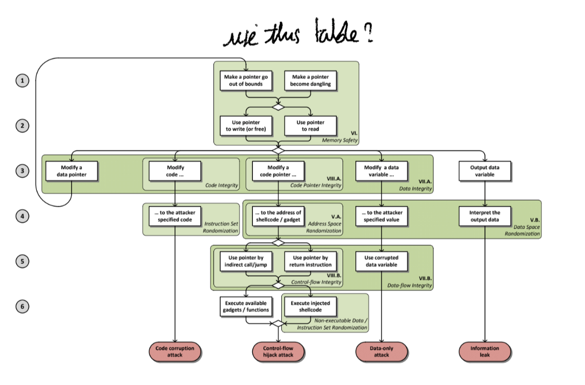

# Szekeres - Eternal war in memory

### we use this paper as it proposes a:

develop a general model of memory corruption at-
tacks and identify different enforceable security policies
based on the model;
• clarify what attack vectors are left unprotected by
currently used and previously proposed protections by
matching their enforced polices with separate phases of
different exploits;
• evaluate and compare proposed solutions for perfor-
mance, compatibility, and robustness;
• discuss why many proposed solutions are not adopted
in practice and what the necessary criteria for a new
solution are.

### C/C++ is bad

Memory corruption bugs in software written in
low-level languages like C or C++ are one of the oldest problems in computer security.

Real world exploits show that
all currently deployed protections can be defeated

We analyze the reasons why protection mechanisms imple-
menting stricter polices are not deployed. To achieve wide
adoption, protection mechanisms must support a multitude of features and must satisfy a host of requirements. Especially important is performance, as experience shows that only solutions whose overhead is in reasonable bounds get deployed

Applications written in low-level languages like C or C++ are prone to these kinds of bugs. The lack of memory safety (or type safety) 

The most obvious solution would be to avoid these languages and to rewrite vulnerable applications
in type-safe languages. Unfortunately, this is unrealistic not only due to the billions of lines of existing C/C++ code, but also due to the low-level features needed for performance critical programs (e.g. operating systems).

arms race between offense and defense

Google Chrome, one of the most secure web
browsers written in C++, was exploited four times during
the Pwn2Own/Pwnium hacking contests in 2012

Memory errors in general allow the attacker to read and
modify the program’s internal state in unintended ways. We
showed that
any
combination of the first two steps in our
memory exploitation model can be used both to corrupt
internal data and to leak sensitive information. Furthermore,
more memory errors can be triggered by corrupting other
pointers. Programming bugs which make these errors possi-
ble, such as buffer overflows and double-frees, are common
in C/C++. When developing in such low-level languages,
both bounds checking and memory management are fully
the programmers responsibility, which is very error prone.
The above described errors are a violation of the
Memory Safety policy. C and C++ are inherently memory unsafe.
According to the C/C++ standards, writing an array be-
yond its bounds, dereferencing a null-pointer, or reading
an uninitialized variable result in
undefined behavior. Since finding and fixing all the programming bugs is infeasible, we need automatic solutions to enforce Memory Safety in

### main axis

Stack cook-
ies [2], exception handler validation [3], Data Execution
Prevention [4] and Address Space Layout Randomization [5]
make the exploitation of memory corruption bugs much
harder, but several attack vectors are still effective under all
these currently deployed basic protection settings. Return-
Oriented Programming (ROP) [6], [7], [8], [9], [10], [11],
information leaks [12], [13] and the prevalent use of user
scripting and just-in-time compilation

### why nothing is done

the performance overhead of the approach outweighs the potential protection, the approach is not compatible
with all currently used features (e.g., in legacy programs), the approach is not robust and the offered
protection is not complete, or the approach depends
on changes in the compiler toolchain or in the source-code
while the toolchain is not publicly available.